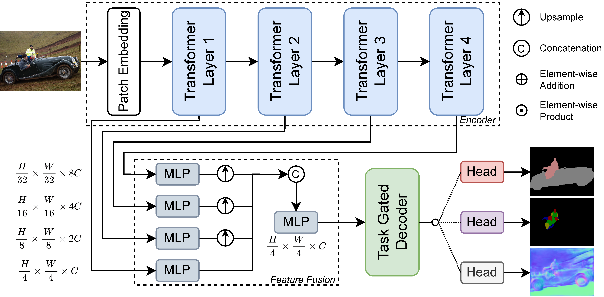

# MTDP_Lib: A Simple Framework for Multi-Task Dense Prediction

## Introduction

This repository provides a simple code base for multi-task dense prediction methods and official implementation of our two papers published on IEEE TMM and ICASSP2024. Our framework supports both *multi-decoder* and *task-conditional* models, and multi-gpu training built on PyTorch DDP. 

> Y. Lu, S. Sirejiding, Y. Ding, C. Wang and H. Lu, "[Prompt Guided Transformer for Multi-Task Dense Prediction](https://ieeexplore.ieee.org/document/10380775)," in IEEE Transactions on Multimedia, vol. 26, pp. 6375-6385, 2024


### Abstract

Task-conditional architecture offers advantage in parameter efficiency but falls short in performance compared to state-of-the-art multi-decoder methods. How to trade off performance and model parameters is an important and difficult problem. In this paper, we introduce a simple and lightweight task-conditional model called Prompt Guided Transformer (PGT) to optimize this challenge. Our approach designs a Prompt-conditioned Transformer block, which incorporates task-specific prompts in the self-attention mechanism to achieve global dependency modeling and parameter-efficient feature adaptation across multiple tasks. This block is integrated into both the shared encoder and decoder, enhancing the capture of intra- and inter-task features. Moreover, we design a lightweight decoder to further reduce parameter usage, which accounts for only 2.7% of the total model parameters. Extensive experiments on two multi-task dense prediction benchmarks, PASCAL-Context and NYUD-v2, demonstrate that our approach achieves state-of-the-art results among task-conditional methods while using fewer parameters, and maintains a significant balance between performance and parameter size.

### Cite

```
@ARTICLE{pgt,
  author={Lu, Yuxiang and Sirejiding, Shalayiding and Ding, Yue and Wang, Chunlin and Lu, Hongtao},
  journal={IEEE Transactions on Multimedia}, 
  title={Prompt Guided Transformer for Multi-Task Dense Prediction}, 
  year={2024},
  volume={26},
  pages={6375-6385},
}
```

> Y. Lu, S. Sirejiding, B. Bayramli, S. Huang, Y. Ding and H. Lu, "[Task Indicating Transformer for Task-Conditional Dense Predictions](https://ieeexplore.ieee.org/document/10445743)," ICASSP 2024 - 2024 IEEE International Conference on Acoustics, Speech and Signal Processing (ICASSP), pp. 3625-3629



### Abstract

The task-conditional model is a distinctive stream for efficient multi-task learning. Existing works encounter a critical limitation in learning task-agnostic and task-specific representations, primarily due to shortcomings in global context modeling arising from CNN-based architectures, as well as a deficiency in multi-scale feature interaction within the decoder. In this paper, we introduce a novel task-conditional framework called Task Indicating Transformer (TIT) to tackle this challenge. Our approach designs a Mix Task Adapter module within the transformer block, which incorporates a Task Indicating Matrix through matrix decomposition, thereby enhancing long-range dependency modeling and parameter-efficient feature adaptation by capturing intra- and inter-task features. Moreover, we propose a Task Gate Decoder module that harnesses a Task Indicating Vector and gating mechanism to facilitate adaptive multi-scale feature refinement guided by task embeddings. Experiments on two public multi-task dense prediction benchmarks, NYUD-v2 and PASCAL-Context, demonstrate that our approach surpasses state-of-the-art task-conditional methods.

### Cite

```
@INPROCEEDINGS{tit,
  author={Lu, Yuxiang and Sirejiding, Shalayiding and Bayramli, Bayram and Huang, Suizhi and Ding, Yue and Lu, Hongtao},
  booktitle={ICASSP 2024 - 2024 IEEE International Conference on Acoustics, Speech and Signal Processing (ICASSP)}, 
  title={Task Indicating Transformer for Task-Conditional Dense Predictions}, 
  year={2024}
}
```

## Results

### PASCAL-Context dataset

| Model | Backbone | #Params | SemSeg | Parts |  Sal  | Normals | Edge  |                                              Checkpoint                                               |
| :---: | :------: | :-----: | :----: | :---: | :---: | :-----: | :---: | :---------------------------------------------------------------------------------------------------: |
|  PGT  |  Swin-T  |  28.5M  | 67.58  | 62.58 | 65.59 |  13.95  | 73.93 |                                                   -                                                   |
| PGT*  |  Swin-T  |  28.5M  | 68.34  | 62.89 | 66.08 |  13.86  | 73.74 | [Google Drive](https://drive.google.com/file/d/1bOX0_CHiR6uje8MOz2Jznt3TVe_3vDKr/view?usp=drive_link) |
|  PGT  |  Swin-S  |  50.1M  | 73.66  | 67.35 | 66.57 |  13.71  | 75.63 |                                                   -                                                   |
|  TIT  |  Swin-T  |  31.3M  | 70.04  | 62.68 | 66.14 |  14.43  | 73.91 |                                                   -                                                   |
| TIT*  |  Swin-T  |  31.3M  | 69.93  | 62.64 | 66.23 |  14.41  | 73.92 | [Google Drive](https://drive.google.com/file/d/1x7buD-YdG0vYRuLZLvtX6i-Ah1TOPzCC/view?usp=drive_link) |

*: We have reproduced our models with the new code in this repository.

### NYUD-v2 dataset

| Model | Backbone | #Params | SemSeg | Depth  | Normals | Edge  |                                              Checkpoint                                               |
| :---: | :------: | :-----: | :----: | :----: | :-----: | :---: | :---------------------------------------------------------------------------------------------------: |
|  PGT  |  Swin-T  |  28.4M  | 41.61  | 0.5900 |  20.06  | 77.05 | [Google Drive](https://drive.google.com/file/d/1BKtJeYPluOYicRTmui0ibWg7maogdfIM/view?usp=drive_link) |
|  PGT  |  Swin-S  |  49.9M  | 46.43  | 0.5468 |  19.24  | 78.04 |                                                   -                                                   |
|  PGT  |  Swin-B  |  88.5M  | 47.42  | 0.5502 |  19.12  | 78.28 |                                                   -                                                   |
|  TIT  |  Swin-T  |  30.9M  | 41.36  | 0.5925 |  19.68  | 77.30 | [Google Drive](https://drive.google.com/file/d/1bjj4grp6SATmf2RiDrs_sPMqiNtoyc-A/view?usp=drive_link) |

## Setup

We have re-implemented our work to create a code library that is user-friendly, easily understandable, and facilitates the development of new models.

### Requirements
The following environment has been tested and recommended, you can use either pypi or conda to create it:
```
python==3.10
pytorch==2.1.2 torchvision==0.16.2
opencv-python==4.9.0.80
scikit-image==0.22.0
timm==0.9.12
tqdm==4.66.1
pyyaml==6.0.1
wandb==0.16.2 (if used)
```

### Datasets
The two datasets PASCAL-Context and NYUD-v2 can be downloaded from the links: [PASCAL-Context](https://drive.google.com/file/d/1TWZydr5_r4hKDM5Zyzrcq712Stg2cw7p/view?usp=drive_link), [NYUD-v2](https://drive.google.com/file/d/1rj3tHdQVYqe-Y3mpxv4EgWsiqgq3z87H/view?usp=drive_link).

You should extract the two datasets to the same directory, and specify the path to the directory as `db_root` variable in `datasets/utils/mypath.py`.

## Usage

### Code structure

```
├──datasets
├──eval
├──models
   ├──backbones
   ├──decoders
   ├──build_models.py
   ├──heads.py
├──losses.py
├──test.py
├──train_utils.py
├──train.py
└──utils.py
```
- `datasets/`: contains the dataset classes and data loaders in `custom_dataset.py`, transformations and augmentations in `custom_transforms.py`.
- `eval/`: contains evaluation metrics, and the code to save predictions in `save_img.py`.
- `models/`: contains the code to build models in `build_models.py`. The models are defined by three components: backbones in `backbones/`, decoders in `decoders/`, and heads in `heads.py`. You can define your own models by following the existing structure.
- `losses.py`: contains the loss functions and hyperpararmeters for each task.
- `test.py`: contains the code to test the trained models.
- `train_utils.py`: contains the code related to model training. Both multi-decoder and task-conditional models are supported. You can also choose between counting by epochs or iterations. 
- `train.py`: contains the code to train the models.
- `utils.py`: contains the utility functions.


### Train 
The config files of our models are defined in `configs/`, you can modify the hyperparameters such as batch size, and output directory is defined in `results_dir`.

To train the model, you can run the following command:
```
torchrun --nproc_per_node=4 train.py --config_path $PATH_TO_CONFIG_FILE --exp $EXP_NAME
```
`$PATH_TO_CONFIG_FILE` is the path to the config file, and `$EXP_NAME` is the name of the experiment. The config file and checkpoints will be saved in `$results_dir/$EXP_NAME`. There are some options you can specify in the command line, such as `--seed $SEED` to set a seed, `--wandb_name $WANDB_NAME` to log with [wandb](https://wandb.ai/site), `--checkpoint $PATH_TO_CHECKPOINT` to resume training from a checkpoint, and `--fp16` to use mixed precision training.

### Test

To evaluation the model, you can run the following command:
```
python test.py --exp $EXP_NAME --results_dir $RESULTS_DIR --evaluate
```
`$EXP_NAME` is the name of the experiment specified when training, and `$RESULTS_DIR` is the output directory specified in config file. When `--evaluate` is used, the model will be evaluated on all tasks, and the predictions for edge will be saved. When `--save` is used, the predictions for all tasks will be saved. The predictions will be saved in `$RESULTS_DIR/$EXP_NAME/predictions`. You can specify the gpu to use by `--gpu $GPU`.

#### Edge evaluation
To evaluate the edge detection result, a evaluation tool is needed to calculate optimal-dataset-scale F-measure (odsF), which is modified from [SEISM](https://github.com/jponttuset/seism) project. Specfically, we use maxDist=0.0075 for PASCAL-Context and maxDist=0.011 for NYUD-v2, following the previous works.

You can follow the steps below:

1. The prediction images should be saved in the directory `$RESULTS_DIR/$EXP_NAME/predictions/edge/img/` after running `test.py`.
2. The SEISM project is based on MATLAB, make sure you have MATLAB installed.
3. Clone our modified version of SEISM into `eval/` folder:
```
cd eval
git clone https://github.com/innovator-zero/seism.git
```
4. Modify the `seism/src/gt_wrappers/db_root_dir.m` to specify the path to the dataset.
5. Run the following command:
```
cd eval
python edge_evaluation.py --exp $EXP_NAME --results_dir $RESULTS_DIR --datasets $DATASET --nms
```
`$DATASET` is either `PASCALContext` or `NYUD`, `--nms` will firstly apply non-maximum suppression (NMS) processing to the predictions, the processed images will be saved in `$RESULTS_DIR/$EXP_NAME/predictions/edge/nms/`.

6. Get the evaluation results by running the following command:
```
python edge_evaluation.py --exp $EXP_NAME --results_dir $RESULTS_DIR --datasets $DATASET --done
```
You can also find detailed results in `$RESULTS_DIR/$EXP_NAME/predictions/edge_test.txt`.

## Acknowledgement

We thank following code repositories for references: [ASTMT](https://github.com/facebookresearch/astmt), [RCM](https://github.com/menelaoskanakis/RCM), [Multi-Task-Learning-Pytorch](https://github.com/SimonVandenhende/Multi-Task-Learning-PyTorch), [Multi-Task-Transformer](https://github.com/prismformore/Multi-Task-Transformer).